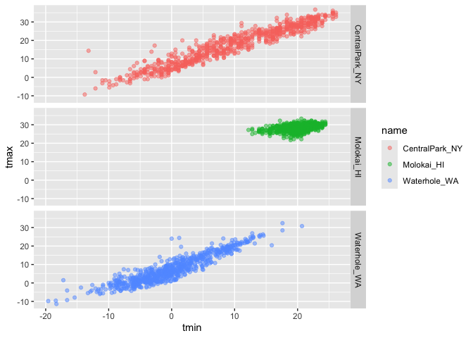
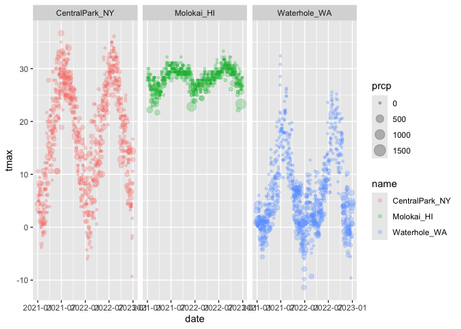

Visualization 1
================
Jonathan Morris
2026-10-01

# Load Packages

``` r
library(tidyverse)
```

    ## ── Attaching core tidyverse packages ──────────────────────── tidyverse 2.0.0 ──
    ## ✔ dplyr     1.1.4     ✔ readr     2.1.5
    ## ✔ forcats   1.0.0     ✔ stringr   1.5.1
    ## ✔ ggplot2   3.5.2     ✔ tibble    3.3.0
    ## ✔ lubridate 1.9.4     ✔ tidyr     1.3.1
    ## ✔ purrr     1.2.0     
    ## ── Conflicts ────────────────────────────────────────── tidyverse_conflicts() ──
    ## ✖ dplyr::filter() masks stats::filter()
    ## ✖ dplyr::lag()    masks stats::lag()
    ## ℹ Use the conflicted package (<http://conflicted.r-lib.org/>) to force all conflicts to become errors

``` r
library(ggridges)

# Load Data:
library(p8105.datasets)
data("weather_df")
```

# Make a scatterplot:

``` r
weather_df |> 
  ggplot(aes(x = tmin, y = tmax, col = name)) +
  geom_point(alpha = 0.25) +
  geom_smooth(se = F)
```

    ## `geom_smooth()` using method = 'loess' and formula = 'y ~ x'

    ## Warning: Removed 17 rows containing non-finite outside the scale range
    ## (`stat_smooth()`).

    ## Warning: Removed 17 rows containing missing values or values outside the scale range
    ## (`geom_point()`).

<!-- -->

# Faceting:

``` r
weather_df |> 
  ggplot(aes(x = tmin, y = tmax, col = name)) +
  geom_point(alpha = 0.5) +
  facet_grid(name ~ .)
```

    ## Warning: Removed 17 rows containing missing values or values outside the scale range
    ## (`geom_point()`).

<!-- --> \# Option +
Cmd + i creates a new cell.

``` r
weather_df |> 
  ggplot(aes(x = date, y = tmax, col = name)) +
  geom_point(aes(size = prcp), alpha = 0.25) +
  facet_grid(. ~ name)
```

    ## Warning: Removed 19 rows containing missing values or values outside the scale range
    ## (`geom_point()`).

<!-- --> Plot of
central park tmax v tmin only, and convert temp to F:

``` r
celsius_to_fahrenheit <- function(celsius) {
  fahrenheit <- (celsius * 9/5) + 32
  return(fahrenheit)
}

weather_df |> 
  filter(name == "CentralPark_NY") |> 
  mutate(tmax_f = celsius_to_fahrenheit(tmax),
         tmin_f = celsius_to_fahrenheit(tmin)) |> 
  ggplot(aes(x = tmin_f, y = tmax_f)) +
  geom_point()
```

<!-- -->
