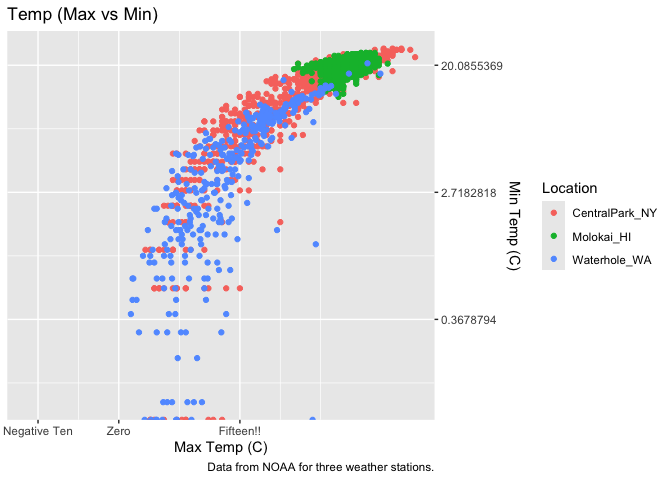
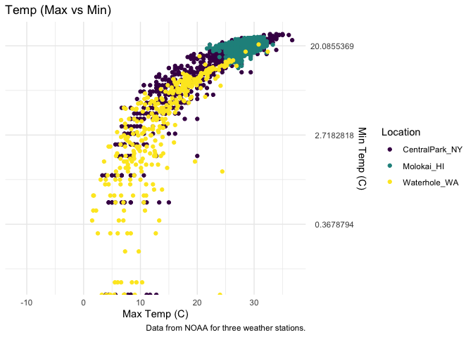
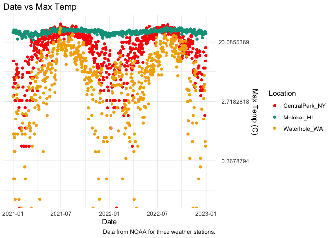
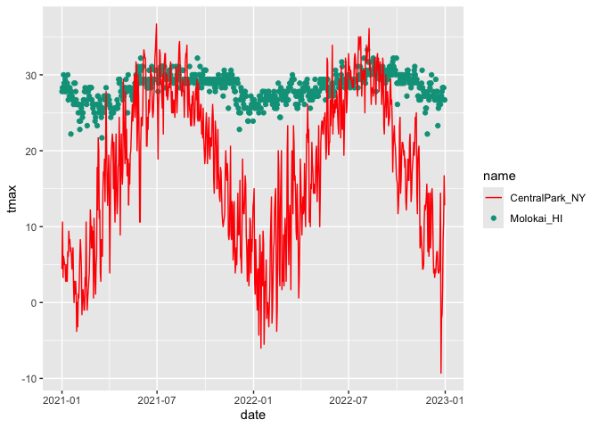
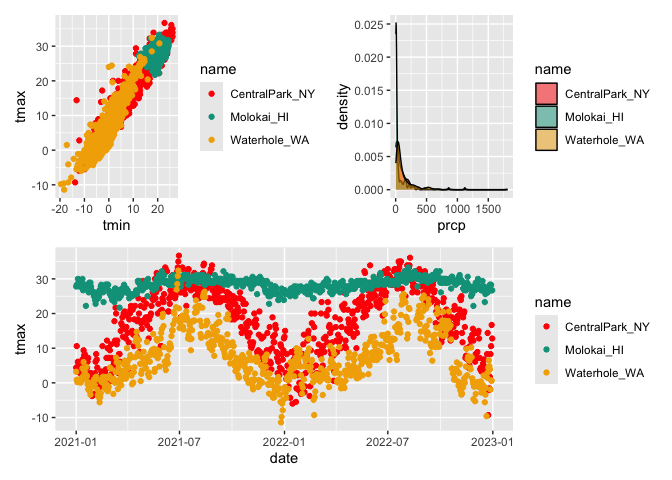
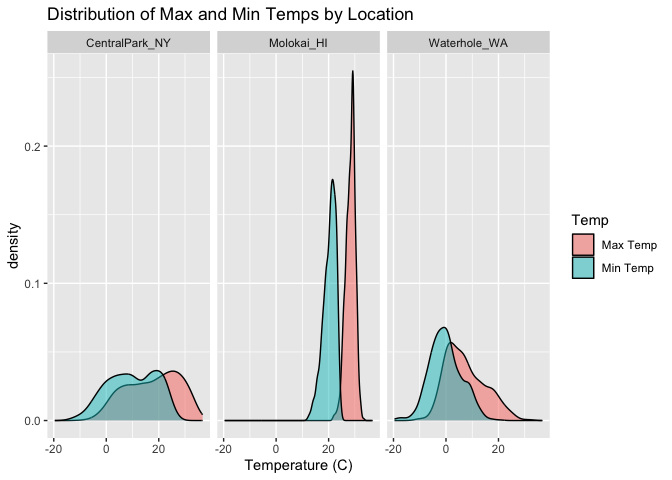
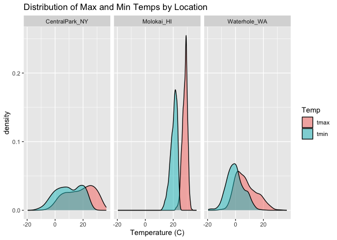

02 viz
================
2026-10-06

# Load Packages

``` r
library(tidyverse)
```

    ## ── Attaching core tidyverse packages ──────────────────────── tidyverse 2.0.0 ──
    ## ✔ dplyr     1.2.1     ✔ readr     2.2.0
    ## ✔ forcats   1.0.1     ✔ stringr   1.6.0
    ## ✔ ggplot2   4.0.3     ✔ tibble    3.3.1
    ## ✔ lubridate 1.9.5     ✔ tidyr     1.3.2
    ## ✔ purrr     1.2.2     
    ## ── Conflicts ────────────────────────────────────────── tidyverse_conflicts() ──
    ## ✖ dplyr::filter() masks stats::filter()
    ## ✖ dplyr::lag()    masks stats::lag()
    ## ℹ Use the conflicted package (<http://conflicted.r-lib.org/>) to force all conflicts to become errors

``` r
library(wesanderson)
library(viridis)
```

    ## Loading required package: viridisLite

``` r
library(patchwork)
library(p8105.datasets)
```

# Load Data:

``` r
data("weather_df")
```

## Start with a scatterplot:

``` r
weather_df |> 
  ggplot(aes(x = tmax, y = tmin, color = name)) +
  geom_point() +
  labs(
    title = "Temp (Max vs Min)",
    x = "Max Temp (C)",
    y = "Min Temp (C)",
    color = "Location",
    caption = "Data from NOAA for three weather stations."
  ) + 
  scale_x_continuous(
    breaks = c(-10, 0, 15),
    labels = c("Negative Ten", "Zero", "Fifteen!!")
  ) +
  scale_y_continuous(
    trans = "log",
    position = "right"
  )
```

    ## Warning in transformation$transform(x): NaNs produced

    ## Warning in scale_y_continuous(trans = "log", position = "right"): log-2.718282
    ## transformation introduced infinite values.

    ## Warning: Removed 520 rows containing missing values or values outside the scale range
    ## (`geom_point()`).

<!-- -->

## Plots with new colors!

``` r
weather_df |> 
  ggplot(aes(x = tmax, y = tmin, color = name)) +
  geom_point() +
  labs(
    title = "Temp (Max vs Min)",
    x = "Max Temp (C)",
    y = "Min Temp (C)",
    color = "Location",
    caption = "Data from NOAA for three weather stations."
  ) +
  viridis::scale_colour_viridis(
    name = "Location",
    discrete = TRUE
  ) +
  scale_y_continuous(
    transform = scales::transform_log(),
    position = "right"
  ) +
  theme(legend.position = "bottom") +
  theme_minimal()
```

    ## Warning in transformation$transform(x): NaNs produced

    ## Warning in scale_y_continuous(transform = scales::transform_log(), position =
    ## "right"): log-2.718282 transformation introduced infinite values.

    ## Warning: Removed 520 rows containing missing values or values outside the scale range
    ## (`geom_point()`).

<!-- -->

``` r
weather_df |> 
  ggplot(aes(x = date, y = tmax, color = name)) +
  geom_point() +
  labs(
    title = "Date vs Max Temp",
    x = "Date",
    y = "Max Temp (C)",
    color = "Location",
    caption = "Data from NOAA for three weather stations."
  ) +
  scale_color_manual(values = wes_palette("Darjeeling1")) +
  scale_y_continuous(
    transform = scales::transform_log(),
    position = "right"
  ) +
  theme(legend.position = "bottom") +
  theme_minimal()
```

    ## Warning in transformation$transform(x): NaNs produced

    ## Warning in scale_y_continuous(transform = scales::transform_log(), position =
    ## "right"): log-2.718282 transformation introduced infinite values.

    ## Warning: Removed 142 rows containing missing values or values outside the scale range
    ## (`geom_point()`).

<!-- -->

## Two more useful plot things:

``` r
central_park_df = 
  weather_df |> 
  filter(name == "CentralPark_NY")

molokai_df  = 
  weather_df |> 
  filter(name == "Molokai_HI")

ggplot(molokai_df, aes(x = date, y = tmax, color = name)) +
  geom_point() +
  geom_line(data = central_park_df) + 
  scale_color_manual(values = wes_palette("Darjeeling1"))
```

    ## Warning: Removed 1 row containing missing values or values outside the scale range
    ## (`geom_point()`).

<!-- -->

## Multiple panels with different plot types:

``` r
ggp_tmax_tmin <- 
  weather_df |> 
  ggplot(aes(x = tmin, y = tmax, color = name)) +
  geom_point() +
  scale_color_manual(values = wes_palette("Darjeeling1"))

ggp_prcp_density <-
  weather_df |> 
  filter(prcp > 0) |> 
  ggplot(aes(x = prcp, fill = name)) +
  scale_fill_manual(values = wes_palette("Darjeeling1")) +
  geom_density(alpha = 0.5) 
  

ggp_seasonal <-
  weather_df |> 
  ggplot(aes(x = date, y = tmax, color = name)) +
  geom_point() +
  scale_color_manual(values = wes_palette("Darjeeling1"))

(ggp_tmax_tmin + ggp_prcp_density) / ggp_seasonal
```

    ## Warning: Removed 17 rows containing missing values or values outside the scale range
    ## (`geom_point()`).
    ## Removed 17 rows containing missing values or values outside the scale range
    ## (`geom_point()`).

<!-- -->

## Data Manipulation:

### Factors:

``` r
weather_df |> 
  mutate(name = fct_relevel(name, c("Molokai_HI", "CentralPark_NY", "Waterhole_WA"))) |> 
  ggplot(aes(x = name, y = tmax)) +
  geom_boxplot()
```

    ## Warning: Removed 17 rows containing non-finite outside the scale range
    ## (`stat_boxplot()`).

<!-- -->

``` r
weather_df |> 
  mutate(name = fct_reorder(name, tmax)) |> 
  ggplot(aes(x = name, y = tmax)) +
  geom_boxplot()
```

    ## Warning: There was 1 warning in `mutate()`.
    ## ℹ In argument: `name = fct_reorder(name, tmax)`.
    ## Caused by warning:
    ## ! `fct_reorder()` removing 17 missing values.
    ## ℹ Use `.na_rm = TRUE` to silence this message.
    ## ℹ Use `.na_rm = FALSE` to preserve NAs.
    ## Removed 17 rows containing non-finite outside the scale range
    ## (`stat_boxplot()`).

<!-- -->

## Layered distribution plot:

``` r
# My Method:
weather_df |> 
  ggplot() +
  geom_density(aes(x = tmax, fill = "Max Temp"), alpha = 0.5) +
  geom_density(aes(x = tmin, fill = "Min Temp"), alpha = 0.5) +
  facet_grid(. ~ name) +
  labs(
    x = "Temperature (C)",
    title = "Distribution of Max and Min Temps by Location",
    fill = "Temp"
  ) 
```

    ## Warning: Removed 17 rows containing non-finite outside the scale range
    ## (`stat_density()`).
    ## Removed 17 rows containing non-finite outside the scale range
    ## (`stat_density()`).

<!-- -->

``` r
# Jeff Method:
weather_df |> 
  select(name, tmax, tmin) |> 
  pivot_longer(
    tmax:tmin,
    names_to = "observation",
    values_to = "temp"
  ) |> 
  ggplot(aes(x = temp, fill = observation)) + 
  geom_density(alpha = 0.5) +
  labs(
    x = "Temperature (C)",
    title = "Distribution of Max and Min Temps by Location",
    fill = "Temp"
  ) +
  facet_grid(. ~ name) 
```

    ## Warning: Removed 34 rows containing non-finite outside the scale range
    ## (`stat_density()`).

<!-- -->

## Back to pups df:
